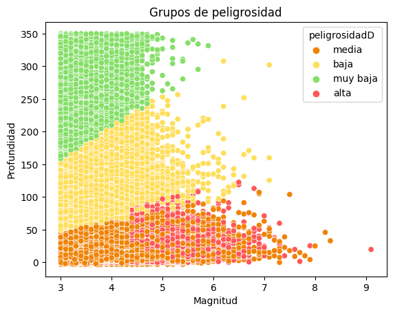

<h1 align="center"> Sistema de alertas sísmicas </h1>

> “Working towards global standardization of seismological networks and effective communication to the civilian community. ”

 **Tabla de Contenido:**
 ---

- [El proyecto ](#el-proyecto-)
- [Equipo ](#equipo-)
- [El repositorio](#el-repositorio)
- [Datos](#datos)
  - [Sísmicos](#sísmicos)
  - [Densidad poblacional](#densidad-poblacional)
  - [Daños](#daños)
- [Pipeline](#pipeline)
  - [Procesamiento de datos](#procesamiento-de-datos)
  - [Almacenamiento](#almacenamiento)
  - [Esquema de la base de datos](#esquema-de-la-base-de-datos)
- [Modelo de agrupamiento de sismos](#modelo-de-agrupamiento-de-sismos)
- [Alerta sísmica](#alerta-sísmica)
- [Licencia](#licencia)

# El proyecto 

En este repositorio se encuentra el desarrollo de un proyecto que tiene como objetivo la implementación y creación de herramientas para el acceso fácil y eficiente a la información sismológica de México, Estados Unidos y Japón. Los sismos son eventos naturales que pueden causar grandes daños a nivel estructural y humano. Por esto, es de interés para la sociedad la predicción de estos eventos. Sin embargo, hasta la fecha ningún ente o comunidad científica ha pronosticado un gran terremoto. Así, los esfuerzos se enfocan en la mitigación a largo plazo de los riesgos de terremotos y en mejoras a corto plazo, ayudando a mejorar la seguridad y organización ciudadana.

Teniendo en cuenta las mitigaciones a corto plazo, se plantea un proyecto en el cual:

- Se cree una base de datos depurada que contemple los datos de las tres naciones de forma estandarizada y se actualice continuamente.
- Implementar mecanismos de comunicación y alerta a la comunidad civil en un lenguaje intuitivamente interpretable.
  
Esto se logró mediante:
- La creación de una base de datos estandarizada utilizando MySQL en el servicio RDS de AWS, con carga automatizada con Airflow.
- El desarrollo de un modelo de aprendizaje no supervisado para la clasificación de los sismos de acuerdo a su "peligrosidad".
- La implementación de una alerta sísmica para México que informa sobre la peligrosidad de un sismos de acuerdo al modelo descrito anteriormente y recomendaciones de acuerdo a características poblacionales del lugar del evento.

# Equipo 
|Nombre          | Correo                     | GitHub                                          | Linkedin|
|----------------|----------------------------|-------------------------------------------------|---------|
|Gustavo Martínez|martinezb.mail@gmail.com    |[gusofficial](https://github.com/gusofficial)    | -       |
|Iván Dellanque  |ivandellanque01@gmail.com   |[IDell49](https://github.com/IDell49)            |[ivandellanque](https://www.linkedin.com/in/ivandellanque/)|
|Matias Harper   |matiasnaranjo_14@hotmail.com|[Matias-Harper](https://github.com/Matias-Harper)|[matias-naranjo-harper](https://www.linkedin.com/in/matias-naranjo-harper/)|
|Leonel Revelo   |leonel_revelo@hotmail.com   |[leo1489](https://github.com/leo1489)            |[leonel](https://www.linkedin.com/in/leonel-revelo-tobar-516984213/)|
|Mariana Vivas   |marianaivivas@gmail.com     |[marianaiv](https://github.com/marianaiv)        |[marianaiv](https://www.linkedin.com/in/marianaiv/)|

# El repositorio
En el repositorio se encuentran los siguientes archivos:
- `airflow`: con los scripts de Airflow y de python para la carga histórica y continua de eventos sísmicos.
- `dataset`: conjuntos de datos utilizados en el proyecto que no provienen de APIs.
- `documentos`: documentos relacionados al desarrollo del proyecto.
- `notebooks`: jupyter notebooks con pruebas para el desarrollo del proyecto.
- `scripts`: aquí se encuentra el script para entrenar el modelo de aprendizaje automático.
- `streamlit`: donde se encuentran los archivos con el código para las aplicaciones desarrolladas en streamlit.
# Datos
## Sísmicos
Los datos sísmicos se obtuvieron de distintas fuentes dependiendo del país. Los datos de Estados Unidos fueron extraídos de [USGS](https://earthquake.usgs.gov), los de Japón de [IRIS](https://www.iris.edu/hq/) y los de México de dos fuentes: [SSN](http://www.ssn.unam.mx) para los datos históricos y USGS para la actualización continua.
## Densidad poblacional
En el análisis de sismos y la base de datos se incluyó información sobre la densidad poblacional de los estados de cada país. La información de todos los países fue proporcionada por entes gubernamentales y se listan a continuación:
- [Estado Unidos](https://www.census.gov/programs-surveys/popest/data/tables.html)
- [Japón](https://www.citypopulation.de/en/japan/cities/)
- [México](https://en.www.inegi.org.mx/app/tabulados/interactivos/?pxq=Poblacion_Poblacion_07_9373f1b6-e6bd-409e-a44d-0c55485df94f)
## Daños
Fue necesario recopilar información sobre sobre muertes, lesiones, destrucción de casas y daños calculados por millón de dólares a causa de eventos sísmicos para ampliar el análisis. Estos fueron extraidos de fuentes directas del gobierno de Estados Unidos y se encuentran en este [link](https://www.usa.gov/government-works/).
# Pipeline
## Procesamiento de datos
Airflow se encarga de correr DAGs individuales para cada pais en donde los datos son transformados hacia un estandar, donde posteriormente son subidos a un balde AWS S3.
## Almacenamiento
Todo esta almacenado en servicios de AWS, donde el balde AWS S3 al recibir los datos estandarizados necesita de AWS Glue como interprete y transportador para poder llevarlos hacia una base de datos MySQL montada en AWS RDS.
## Esquema de la base de datos
Tiene un esquema de copo de nieve donde se usa la tabla de hechos *seism* como centro, las tablas *location* y *density* proveen mas informacion al analista al hacer queries, pero solo si le es necesaria. Así, la base de datos es de la siguiente forma:

  

Despues de que el dato es cargado en AWS RDS, ya es libre de ser accedido posteriormente por:
- El modelo de Machine Learning basado en la libreria de Scikit-learn
- La pagina web de alertas montada en Streamlit
- El dashboard analitico hecho en Power Bi

Un diagrama del pipeline se encuentra a continuación:

  

Una demostración del funcionamiento se puede ver en [este video](https://www.youtube.com/watch?v=NQzYlH-22zY).

# Modelo de agrupamiento de sismos
Para realizar el agrupamiento se utilizó K-Means con 4 grupos.

El objetivo fue agrupar los sismos de acuerdo a su peligrosidad y para esto se utilizó el "indice de peligrosidad" que definimos como: $\frac{p}{m}$ donde *d* es la profundidad del foco del sismo y *m* la magnitud en escala Richter. Además utilizamos etiquetas de acuerdo a la definición dada por [World Bank](https://blogs.worldbank.org/sustainablecities/how-do-we-define-cities-towns-and-rural-areas) de ciudad, pueblo y zona rural según la densidad poblacional.

Los grupos de clasificación se puede observar en dos dimensiones. Sin embargo, no se observa la diferencia entre dos de los grupos porque en la clasificación se utilizaron 3 variables: dos de forma implicita en la variable de peligrosidad y las etiquetas de densidad.

  

El resultado de la clasificación se puede visualizar en un mapa interactivo realizado en streamlit donde se grafican los ultimos 1000 sismos por país. Se encuentra en [este link]()

El script para entrenar el modelo de aprendizaje automático se encuentra en la carpeta `scripts` del repositorio.
# Alerta sísmica
El alerta sísmica se diseñó para informar a la población mexicana sobre los sismos de una manera fácil de comprender para todo cualquier persona. El nivel de alerta está dado por la predicción de la peligrosidad del sismo hecha por el modelo de aprendizaje automático. Las recomendaciones sobre que hacer durante el sismo son distintas para las ciudades, pueblos y zonas rurales, de manera que sean realmente útiles para la comunidad.

Esta aplicación fue realizada utilizando streamlit y se encuentre en [este link](alertasismicamexico.streamlit.app).
# Licencia

El uso de este trabajo está licenciado bajo [GNU General Public License v3.0 (GNU GPLv3)](https://choosealicense.com/licenses/gpl-3.0/).
