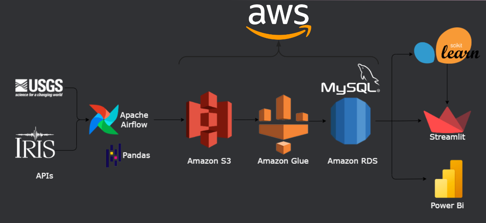

<h1 align="center"> Seismic warning system </h1>

> “Working towards global standardization of seismological networks and effective communication to the civilian community. ”

 **Table of Contents:**
 ---

- [The Project ](#the-project-)
- [Team ](#team-)
- [The repository](#the-repository)
- [Data](#data)
- [Pipeline](#pipeline)
- [Seismic clustering model](#seismic-clustering-model)
- [Seismic alert](#seismic-alert)
- [License](#license)

# The Project 

The repository contains the development of a project that aims to implement and create tools for easy and efficient access to seismological information from Mexico, the United States, and Japan. Earthquakes are natural events that can cause significant structural and human damage. Therefore, the prediction of these events is of interest to society. However, no scientific body or community has predicted a significant earthquake. Thus, efforts are focused on long-term mitigation of earthquake risks and short-term improvements, helping to improve citizen safety and organization.

Taking into account the short-term improvements, we proposed a project in which:

- A refined database is created that contemplates the data of the three nations in a standardized way and is continuously updated.
- Implementing communication and warning mechanisms to the civil community in an intuitively interpretable language.
  
These goals were achieved by:
- Creating a standardized database using MySQL on the AWS RDS service, with automated loading with Airflow.
- The development of an unsupervised learning model for classifying earthquakes according to their "dangerousness."
- The implementation of a Seismic alert for Mexico that informs about the danger of an earthquake according to the model described above and recommendations according to population characteristics of the place of the event.

# Team 
|Name        | E-mail                | GitHub                                          | Linkedin|
|----------------|----------------------------|-------------------------------------------------|---------|
|Gustavo Martínez|martinezb.mail@gmail.com    |[gusofficial](https://github.com/gusofficial)    |[gustavo](https://www.linkedin.com/in/gustavo-mart%C3%ADnez-b8027a65/)|
|Iván Dellanque  |ivandellanque01@gmail.com   |[IDell49](https://github.com/IDell49)            |[ivandellanque](https://www.linkedin.com/in/ivandellanque/)|
|Matias Harper   |matiasnaranjo_14@hotmail.com|[Matias-Harper](https://github.com/Matias-Harper)|[matias-naranjo-harper](https://www.linkedin.com/in/matias-naranjo-harper/)|
|Leonel Revelo   |leonel_revelo@hotmail.com   |[leo1489](https://github.com/leo1489)            |[leonel](https://www.linkedin.com/in/leonel-revelo-tobar-516984213/)|
|Mariana Vivas   |marianaivivas@gmail.com     |[marianaiv](https://github.com/marianaiv)        |[marianaiv](https://www.linkedin.com/in/marianaiv/)|

# The repository
The following files are in the repository:
- `airflow`: with Airflow and python scripts for historical and continuous loading of seismic events.
- `dataset`: data sets used in the project that do not come from APIs.
- `documents`: documents related to the project development.
- `notebooks`: jupyter notebooks with tests for the project development.
- `scripts`: here, you can find the script to train the machine learning model.
- `streamlit`: where you can find the files with the code for the applications developed in streamlit.
# Data
## Seismic
Seismic data were obtained from different sources depending on the country. U.S. data were extracted from [USGS](https://earthquake.usgs.gov), Japan from [IRIS](https://www.iris.edu/hq/), and Mexico from two sources: [SSN](http://www.ssn.unam.mx) for historical data and USGS for continuous updating.
## Population density
Information on the population density of the states of each country was included in the seismic analysis and the database. The information for all countries was provided by governmental entities and is listed below:
- [United States](https://www.census.gov/programs-surveys/popest/data/tables.html)
- [Japan](https://www.citypopulation.de/en/japan/cities/)
- [Mexico](https://en.www.inegi.org.mx/app/tabulados/interactivos/?pxq=Poblacion_Poblacion_07_9373f1b6-e6bd-409e-a44d-0c55485df94f)
## Damages
It was necessary to collect information on deaths, injuries, destruction of homes, and estimated damages per million dollars due to seismic events to expand the analysis. These were extracted from a U.S. government site: [link](https://www.usa.gov/government-works/).
# Pipeline
## Data Processing
Airflow is responsible for running individual DAGs for each country where the data is transformed into a standard, where it is then uploaded to an AWS S3 bucket.
## Storage
Everything is stored in AWS services, where the AWS S3 bucket, when receiving the standardized data, needs AWS Glue as an interpreter and transporter to take it to a MySQL database mounted on AWS RDS.
## Database schema
It has a snowflake schema where the fact table *seism* is used as the center, the *location* and *density* tables provide more information to the analyst when querying, but only if needed. Thus, the database is as follows:

  

After the data is loaded into AWS RDS, it is free to be accessed later by:
- The Machine Learning model based on the Scikit-learn library.
- The alerts web page built in Streamlit
- The analytical dashboard made in Power Bi

A diagram of the pipeline can be found below:

  

A demonstration of the operation can be seen in [this video].(https://www.youtube.com/watch?v=NQzYlH-22zY).

# Seismic clustering model
To perform the grouping we used K-Means with 4 groups.

The objective was to group the earthquakes according to their dangerousness and for this we used the "dangerousness index" that we defined as: $\frac{p}{m}$ where *d* is the depth of the focus of the earthquake and *m* the magnitude in Richter scale. We also use labels according to the definition given by [World Bank](https://blogs.worldbank.org/sustainablecities/how-do-we-define-cities-towns-and-rural-areas) of city, town and rural area according to population density.

The classification groups can be observed in two dimensions. However, the difference between two of the groups is not observed because 3 variables were used in the classification: two implicitly in the hazard variable and the density labels.

  

The result of the classification can be visualized in an interactive map made in streamlit where the last 1000 earthquakes per country are plotted. It can be found at [this link](https://seismap.streamlit.app/).

The script for training the machine learning model is located in the `scripts` folder of the repository.
# Seismic alert
The seismic alert was designed to inform the Mexican population about earthquakes in a way that is easy to understand for everyone. The level of alert is given by the prediction of the danger of the earthquake made by the automatic learning model. The recommendations on what to do during the earthquake are different for cities, towns and rural areas, so that they are really useful for the community.

This application was made using streamlit and can be found at [this link].(alertasismicamexico.streamlit.app).
# License

The use of this work is licensed under [GNU General Public License v3.0 (GNU GPLv3)](https://choosealicense.com/licenses/gpl-3.0/).
