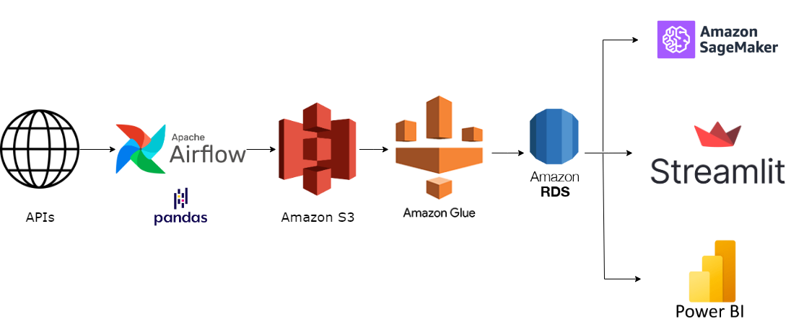
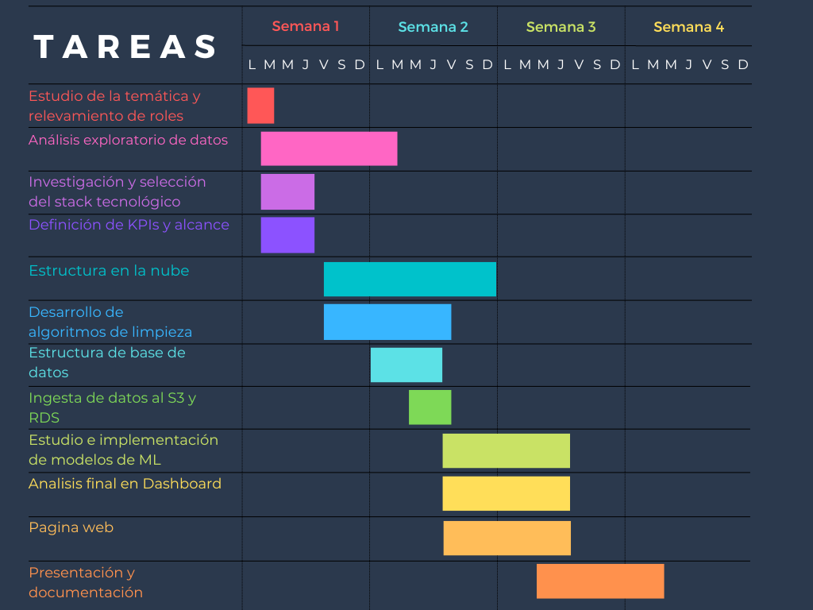

# Hoja de ruta

  

Somos parte del equipo de la empresa MLGI, data solutions. Es un honor para nosotros formar parte del proyecto tri-nacional “Working towards global standardization of seismological networks and effective communication to the civilian community''. Invitados por el Servicio Sismológico Nacional (SSN) de México.  Trabajo conjunto llevado a cabo entre Estados Unidos (USGS), Japón (JMA) y México (SSN).

## Descripción del problema

Los sismos son movimientos vibratorios de la superficie terrestre que pueden causar grandes daños a nivel estructural y humano. Son eventos que se describen mediante modelos caóticos, es decir, no se puede predecir exactamente cuándo van a suceder y sus características. Aunque el evento sísmico no se pueda predecir exactamente, se estudia cómo anticiparlo. Hasta la fecha, ningún ente o comunidad científica ha pronosticado un gran terremoto[1]. Por esto, los esfuerzos se enfocan en la mitigación a largo plazo de los riesgos de terremotos y en mejoras a corto plazo, ayudando a mejorar la seguridad y organización ciudadana.

Particularmente en latinoamérica, en países como México, que se encuentra sobre la falla de San Andrés y presenta gran cantidad de sismos, es necesario el desarrollo de herramientas que ayuden a los ciudadanos a entender y saber cuándo y cómo tomar medidas preventivas a la hora de que suceda un sismo. En México existe un sistema de alertas sísmicas, el cual avisa con al menos 50 segundos de anticipación la llegada de ondas sísmicas importantes[2]. Sin embargo, la alerta se difunde a través de radio y mediante alarmas físicas que emiten un sonido para alertar a la población. El desarrollo de las alertas emitidas a través de aplicaciones web o telefonía celular puede demostrar mejoras al sistema que ya está en lugar.

## Objetivo del proyecto.

Objetivos generales del trabajo:
Desarrollar mejores herramientas para el acceso fácil y eficiente a la información sismológica de México, Estados Unidos y Japón.
Facilitar la visualización de los datos que se poseen sobre el tema, buscando generar un mayor entendimiento colectivo de la situación sismológica.

Objetivos específicos:
- Generar un sistema web que emita alertas sísmicas con un lenguaje que sea fácil de entender para el total de la población.
Esto se  logrará mediante:
- La creación de una base de datos alimentada automáticamente que incluya eventos sísmicos de México, Estados Unidos y Japón con el fin de mejorar el análisis de estos sucesos y la capacidad de predicción.
- La clasificación de eventos sísmicos de acuerdo a variables sociales como la densidad de población (lo cual lleva a la densidad de edificios en ciudades desarrolladas, que aumenta la peligrosidad de un sismo) y la comparación con sismos de EE.UU y Japón.

### Alcance
Al finalizar el proyecto se desea obtener:
- Un modelo de aprendizaje automático no supervisado que clasifique los eventos de acuerdo a su peligrosidad.
- Una base de datos que se actualice automáticamente con datos sísmicos de EE.UU, Japón y México.
- Un sistema de alertas sísmicas para México que se actualice automáticamente, el cual va a brindar información a la población en un lenguaje comprensible sobre el último sismo ocurrido.

Este proyecto no contempla:
- Dar información sobre refugios o lugares a los que ir a la hora de evacuar por un terremoto.
- La creación de una API de la que se pueda descargar información públicamente.
- El estudio riguroso de la predicción de eventos sísmicos.

### KPIs a utilizar	
Los KPIs o Medidores de Desempeño son una serie de métricas que se utilizan para sintetizar la información sobre la eficacia y productividad de las acciones que se lleven a cabo en un trabajo con el fin de poder tomar decisiones y determinar aquellas que han sido más efectivas a la hora de cumplir con los objetivos marcados en una tarea o proyecto concreto.
Previamente se deberá definir en qué escala de Richter consideraremos importante recopilar esta información y discretizar la escala para definir en el trabajo lo que clasificaremos como “alta peligrosidad”:
Tiempo medio de duración de sismos de “alta peligrosidad”.
Daños por Localidades en base a la distancia del epicentro de los sismos.
Histórico de los Sismos más intensos con mayor potencial destructivo en México.
Desfase temporal entre el evento y la carga de los  datos en las APIs utilizadas.
Precisión de clasificación del modelo propuesto de sismos de “alta peligrosidad”.
Desfase temporal entre la carga de los datos y la generación de la alerta.

## Calidad de los datos
Las fuentes principales de datos de eventos sísmicos son: USGS para Estados Unidos, IRIS para Japón y SSN para México. Un reporte con mayor profundidad de la calidad de los datos se encuentra en el siguiente [link](https://github.com/marianaiv/seismic-alerts/blob/main/documentos/reporte-calidad-datos.ipynb)

### EE.UU
Los datos de USGS son los que poseen mayor cantidad de columnas y a su vez, mayor información sobre los eventos sísmicos.
La mayoría de las columnas tienen los datos completos, salvo algunas columnas técnicas que no se encuentran en los conjuntos de datos de los demás países, por lo que podrían descartarse para este trabajo. Entre la información interesante que poseen los datos extraídos de USGS se encuentran: etiquetas que indican propensión a tsunami y etiqueta sobre qué tan significativo es el sismo.

A nivel general, los datos obtenidos de la API de USGS requieren transformaciones sencillas como transformación de tipo de dato para las fechas y normalización de strings.

### Japón
Los datos provenientes de IRIS no poseen faltantes y requieren pocas transformaciones. Proporcionan información puntual sobre las características del sismo. En los datos analizados, se halló que en comparación con los datos de EE.UU, el catálogo de IRIS no registra sismos de baja magnitud para Japón.

### México
Los datos de SNS son los que tienen mayor calidad: no poseen faltantes y no requieren transformaciones para su uso. Esta base de datos posee sismos de magnitudes bajas y al igual que los datos de Japón y contrario al conjunto de datos de EE.UU, solo posee información puntual de sismo.

## Tecnologías a utilizar / Stack tecnológico 

Tecnologías que se utilizaran para la realización del proyecto:
Github: como herramienta de comunicación y manipulación en conjunto del código y requerimientos que posee el trabajo en cuestión.
Python: Se utilizará la librería Pandas mayormente para el EDA, ingesta y normalización de los datos.
APIs: La extracción de datos se realizará por medio de APIs específicas. En el caso de Estados Unidos los datos será provistos por la API del Servicio Geológico de Estados Unidos​​ o USGS y la de Japón por la API de Incorporated Research Institutions for Seismology o IRIS.
Base de datos SQL: Se realizará una base de datos relacional SQL, con una estructura de copo de nieve (una tabla de hechos, con sus dimensiones en varios niveles). Esto permitirá hacer queries (consultas) para extraer la información necesaria de manera eficiente. 
Servicios en la nube: Se utilizarán datasets con un estimado de más de 4 millones de filas, la solución que se plantea ante esto es guardar la información en un servicio en la nube por medio de un data-lake, se emplearán los servicios de AWS (Amazon Web Service) para guardar, transformar y cargar los datos a una base de datos postgreSQL integrada en la plataforma. 

Por la centralidad e importancia de esta última herramienta podemos detenernos y comparar los tres servicios en la nube más populares AWS/Azure/Google Cloud. Las principales razones por las que se decidió utilizar AWS son:
- Popularidad: AWS primero, Azure segundo (con 22% del mercado) y Google Cloud tercero. El resto de los servicios de nube estuvieron subiendo en popularidad estos últimos 3 años.
- Billing: tiene un dashboard integrado para saber el costo por minuto si es que hay alguno.
- Longevidad: AWS empezó 5 años antes que el resto y con políticas de mantenimiento del servicio muy respetadas en el mercado, Microsoft no se queda atrás, pero Google es conocido por dejar de soportar productos que les dejan de interesar.- Latencia: Amazon posee la mayor cantidad de nodos regionales, garantizando la menor cantidad de latencia posible a cualquier usuario.
- Estabilidad: AWS posee un máximo de 3 hrs seguidas offline en toda su historia, Azure, en cambio, posee un máximo de 40 horas offline. Por último google solo 14 minutos, pero esto es entendible ya que su escala es mucho menor .
- Tecnologías: AWS tiene ventaja en flexibilidad de servicios en Machine Learning, que nos va a permitir implementar modelos fácilmente para la clasificación de los terremotos.  
- Regiones: líder en cantidad de regiones y zonas habilitadas. 

Las herramientas específicas se muestran en el diagrama:

  

Los pasos del pipeline diagrama se describen a continuación:

1. Extraer datos de las APIs seleccionadas con un operador de Python de Airflow.
2. Crear un data lake en la nube con un S3 Bucket.
3. Cargar datos a S3 Bucket con Airflow cada hora.
4. Con GLUE cargar y procesar datos hacia la base de datos postgreSQL en AWS RDS.
5. Ya con la base de datos limpia, entrenamos un modelo de Machine Learning con los datos históricos, el cual va a ser usado para clasificar los eventos sísmicos concurrentes. Se puede usar AWS Sagemaker 
6. Crear Dashboard/Presentación que sea capaz de representar los datos de una manera agradable al público. Posibilidad de graficar con servicios de AWS
7. Crear conexion como una API a la base de datos, que posea la capacidad de comunicarle al usuario la situación del último sismo en su localidad

## Riesgos
Al realizar este trabajo se pueden presentar algunos contratiempos:
- La inmediatez de la alerta y el tiempo de actualización de los datos se ve limitada por las fuentes de información utilizadas.
- El uso de la herramienta AWS como servicio de nube proyecta un costo posterior de mantenimiento del servicio que correrá por parte del cliente o las naciones involucradas.

## Metodología de trabajo.
La totalidad de tareas se van a distribuir entre un equipo multidisciplinario especializado en data encabezado por Mariana Vivas como Functional Analyst, Iván Dellanque en Data Engineer, Gustavo Martínez  Data Scientist y Leonel Revelo y Matías Naranjo Harper como Data Analysts.

  

[1]: https://www.usgs.gov/faqs/can-you-predict-earthquakes
[2]: https://www.gob.mx/segob/articulos/como-funciona-la-alertasismica